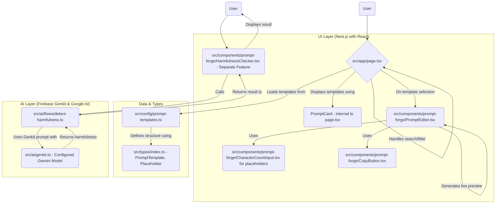

# Project Study Summary: "Studio PromptForge"

This document summarizes the findings from a study of the "Studio PromptForge" project.

## 1. Project Goal:
To create a web application named "PromptForge" that serves as an "Ultimate AI Prompt Library." It allows users to browse, search, and select predefined AI prompt templates, customize them by filling in placeholders, and then generate a final prompt that can be copied for use with AI models like ChatGPT, Anthropic, and Gemini. It also includes a feature to detect potentially harmful content in user-provided prompts using AI.

## 2. Core Technologies & Architecture:
*   **Frontend Framework:** Next.js (a React framework)
*   **UI Components:** Primarily Shadcn/ui, with custom components built for specific functionalities.
*   **Styling:** Tailwind CSS.
*   **AI Integration:** Firebase Genkit, specifically using the `@genkit-ai/googleai` plugin with the `googleai/gemini-2.0-flash` model.
*   **Language:** TypeScript.

## 3. Key Functional Components & Data Flow:

## 4. Detailed Breakdown of Studied Files:
*   **`README.md`**: Basic project introduction.
*   **`src/app/page.tsx`**: The main entry point and UI for displaying the prompt library. It handles template listing, filtering, searching, and rendering the `PromptEditor` upon selection.
*   **`src/config/prompt-templates.ts`**: Contains the raw data for all predefined prompt templates, including their ID, name, description, category, template string, placeholders, and icons.
*   **`src/types/index.ts`**: Defines the TypeScript interfaces for `PromptTemplate` and `Placeholder`, ensuring type safety and clear data structure.
*   **`src/components/prompt-forge/PromptEditor.tsx`**: The core component for interacting with a selected template. It dynamically generates input fields for placeholders, provides a live preview of the generated prompt as users type, and allows copying the final prompt.
*   **`src/components/prompt-forge/CharacterCountInput.tsx`**: A reusable UI component for text input (single-line or textarea) that displays a character count and can indicate if a field is required.
*   **`src/components/prompt-forge/CopyButton.tsx`**: A simple button component that copies provided text to the clipboard and shows a toast notification.
*   **`src/components/prompt-forge/TemplateSelector.tsx`**: An (currently unused) alternative UI component for selecting templates via a dropdown, grouping them by category.
*   **`src/components/prompt-forge/HarmfulnessChecker.tsx`**: A standalone feature that allows users to input any prompt and uses an AI backend to check for potentially harmful content.
*   **`src/ai/flows/detect-harmfulness.ts`**: A Firebase Genkit "flow" that defines the logic for harmfulness detection. It takes a prompt, uses a predefined AI prompt template to instruct the Gemini model, and returns whether the input is harmful and a reason. It also includes safety settings for the AI model.
*   **`src/ai/genkit.ts`**: Configures Firebase Genkit to use the `googleAI` plugin and specifies `gemini-2.0-flash` as the default model.
*   **`docs/blueprint.md`**: Provides a high-level summary of the app's name (PromptForge), core features, and style guidelines.

## 5. Conclusion of Study:
The "Studio PromptForge" project is a well-structured Next.js application designed to help users work with AI prompts. It leverages Firebase Genkit for sophisticated AI interactions (like harmfulness checks) powered by Google's Gemini models. The frontend provides a user-friendly interface for browsing, customizing, and generating prompts.